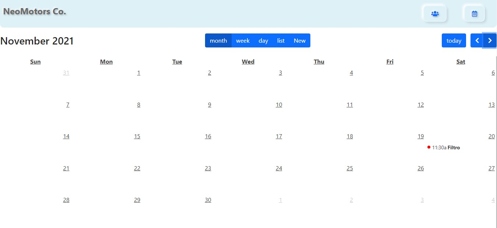

# CRM With Calendar

### Tools

- [React.js](https://reactjs.org/)
- [Strapi.io](https://strapi.io/)
- [Axios](https://axios-http.com/)
- [Material Table](https://material-table.com/#/)
- [Full-Calendar](https://fullcalendar.io/)

### Development

A Customer Relationship Management app built using React and connected to Strapi database. The app permits to create a client and any future events created with the name of the same client will be automitacally be added to the events associated to the client matched. Events and clients can be easily edited and deleted from the database. The table of clients is created using material table which allows you to filter the clients as well as search for a specific client and directly view the events associated. The full calendar plugin allows for easier access to the events for a specific day, month or year.
